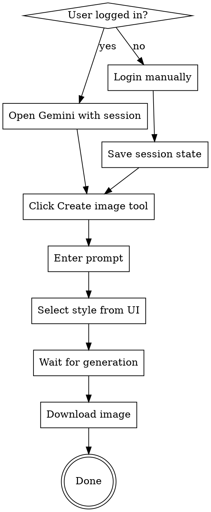

# Gemini Image Generation

## Overview

**Use the agent-browser command-line tool to automate Gemini's image generation workflow.** Gemini has a built-in image generation model (nano banana) accessible through the "Create image" tool in the web UI.

**Critical:** This skill requires the agent-browser tool. All commands below use `agent-browser` CLI.

## When to Use

Use when:
- User asks to generate images in Gemini
- User mentions "nano banana" (Gemini's image generation model)
- User wants to use Gemini's image creation feature
- Task involves Gemini image generation with style selection

Don't use for:
- Other image generation services (DALL-E, Midjourney, etc.)
- Gemini text chat without image generation
- API-based image generation

## Workflow



## Step-by-Step Guide

### 1. Open Gemini with Session Persistence

```bash
# If user already logged in, use named session
agent-browser --session-name gemini open "https://gemini.google.com"

# If first time, use headed mode for manual login
agent-browser --headed --session-name gemini open "https://gemini.google.com"
# Wait for user to login, then session auto-saves
```

### 2. Find and Click "Create Image" Tool

```bash
agent-browser snapshot -i
# Look for: button "🖼️ Create image" or similar
agent-browser click @eN  # Click the Create image button
```

### 3. Enter Image Prompt

```bash
agent-browser wait 2000
agent-browser snapshot -i
# Look for: textbox "Enter a prompt for Gemini"
agent-browser fill @eN "your image description here"
```

### 4. Select Style from UI (Critical Step)

**DO NOT put style in text prompt.** Styles are clickable UI elements.

**Two approaches:**

**A. User specifies style (if known):**
```bash
agent-browser snapshot -i -C  # Include cursor-interactive elements
# Look for the specified style and click it
agent-browser click @eN  # Click desired style
agent-browser wait 2000  # Wait for style to register
```

**B. Let user choose (recommended):**
```bash
agent-browser snapshot -i -C
# Extract all available styles and present to user
# Example output:
# Available styles:
# 1. Monochrome (@e12)
# 2. Color block (@e13)
# 3. Cinematic (@e21)
# 4. Oil painting (@e31)
# ... etc

# Ask user: "Which style would you like? (enter number or name)"
# Then click the selected style
agent-browser click @eN
agent-browser wait 2000
```

**Getting style list programmatically:**
```bash
agent-browser snapshot -i -C | grep "clickable" | grep -v "button\|link\|textbox"
# This shows all clickable style options with their refs
```

**Common styles:**
- Cinematic (photorealistic, dramatic)
- Monochrome (black and white)
- Oil painting (artistic)
- Sketch (hand-drawn)
- Technicolor (vibrant colors)

### 5. Send Request

```bash
agent-browser snapshot -i
# Look for: button "Send message"
agent-browser click @eN
```

### 6. Wait for Generation

Image generation takes 20-40 seconds. Wait adequately:

```bash
agent-browser wait 30000  # Wait 30 seconds
agent-browser snapshot -i
# Look for: button "Download full size image"
```

If still generating (button shows "Stop response"), wait longer:

```bash
agent-browser wait 20000
agent-browser snapshot -i
```

### 7. Download Image

```bash
agent-browser snapshot -i
# Look for: button "Download full size image"
agent-browser download @eN ./output-filename.png
```

## Complete Example

### Example 1: User Chooses Style Interactively

```bash
# Open with saved session
agent-browser --session-name gemini open "https://gemini.google.com"

# Click Create image tool
agent-browser snapshot -i
agent-browser click @e6  # Create image button

# Enter prompt
agent-browser wait 2000
agent-browser snapshot -i
agent-browser fill @e10 "一只可爱的猫咪坐在电脑前编程"

# Get available styles and let user choose
agent-browser snapshot -i -C > styles.txt
# Parse and present styles to user:
# "Available styles: Monochrome, Color block, Cinematic, Oil painting, Sketch..."
# "Which style would you like?"

# User selects "Cinematic"
agent-browser click @e21  # Based on user's choice
agent-browser wait 2000

# Send request
agent-browser snapshot -i
agent-browser click @e13  # Send message button

# Wait and download
agent-browser wait 30000
agent-browser snapshot -i
agent-browser download @e12 ./cat-coding.png
```

### Example 2: Style Pre-specified by User

```bash
# User said: "Generate image with Oil painting style"
agent-browser --session-name gemini open "https://gemini.google.com"
agent-browser snapshot -i
agent-browser click @e6

agent-browser wait 2000
agent-browser snapshot -i
agent-browser fill @e10 "一个机器人在花园里浇花"

# Find and click Oil painting style
agent-browser snapshot -i -C
agent-browser click @e31  # Oil painting
agent-browser wait 2000

agent-browser snapshot -i
agent-browser click @e13

agent-browser wait 30000
agent-browser snapshot -i
agent-browser download @e12 ./robot-garden.png
```

## Common Mistakes

| Mistake | Fix |
|---------|-----|
| Putting style in text prompt | Use UI style picker with `snapshot -i -C` and click |
| Not waiting after style click | Add `wait 2000` after clicking style before sending |
| Not waiting long enough for generation | Wait at least 30 seconds after sending |
| Forgetting session persistence | Use `--session-name` to avoid re-login |
| Not using `-C` flag for styles | Styles are cursor-interactive, need `-C` flag |
| Clicking before page loads | Add `wait 2000` after navigation/clicks |
| Assuming generation started | Check for "Stop response" button or take screenshot to verify |

## Troubleshooting

**"No style options visible":**
- Use `agent-browser snapshot -i -C` to see cursor-interactive elements
- Styles appear after clicking "Create image" tool

**"Image not generating":**
- Check if "Stop response" button exists (still generating)
- Wait longer (up to 60 seconds for complex images)
- Take screenshot to verify: `agent-browser screenshot status.png`

**"Download button not found":**
- Look for: "Download full size image" or "Copy image"
- May need to scroll: `agent-browser scroll up 500`

**"Session lost":**
- Re-login with `--headed` mode
- Session auto-saves when using `--session-name`

**"Workflow seems stuck":**
- Take screenshot: `agent-browser screenshot debug.png`
- Check page text: `agent-browser get text body > page.txt`
- If stuck on style selection screen, refresh: `agent-browser open "https://gemini.google.com/app"`
- Start workflow from beginning

## Session Management

**First time setup:**
```bash
agent-browser --headed --session-name gemini open "https://gemini.google.com"
# User logs in manually
agent-browser close  # Session auto-saved
```

**Subsequent uses:**
```bash
agent-browser --session-name gemini open "https://gemini.google.com"
# Already logged in
```

**Check saved sessions:**
```bash
agent-browser state list
```
